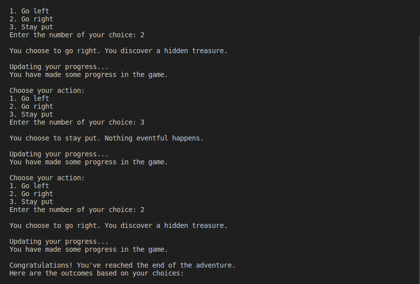

# Desafio de algoritmo usando Python
- Este script Python simples simula uma interface game em texto onde o jogador faz escolhas que afetam o resultado da história.

1. __Introdução e história de fundo:__
- Ao executar o script, ele exibirá uma mensagem de boas-vindas e definirá o cenário para a aventura.

2. __Escolhas e opções do jogador:__
- Você será solicitado a fazer escolhas inserindo um número correspondente à ação desejada.
    1: Vá para esquerda
    2: Vire a direita
    3: Fique aqui

3. __Feedback e consequências:__
- Com base na sua escolha, o jogo fornecerá feedback e descreverá as consequências da sua decisão.

    - Escolher ir para a esquerda pode levar ao encontro de uma criatura amigável.
    - Escolher dar certo pode resultar na descoberta de um tesouro escondido.
    - Ficar parado pode resultar em nada de importante acontecendo.

4. __Atualizações de progresso:__
- Após cada escolha, o script simulará atualizações de progresso para criar uma experiência dinâmica.

